# Экраны "Крокодил"

## Регистрация
На экране регистрации пользователь вводит желаемый логин и пароль. Если логин занят, то пользователю отображается сообщение об этом.
При успешной регистрации пользователь переадресовывается на страницу авторизации.

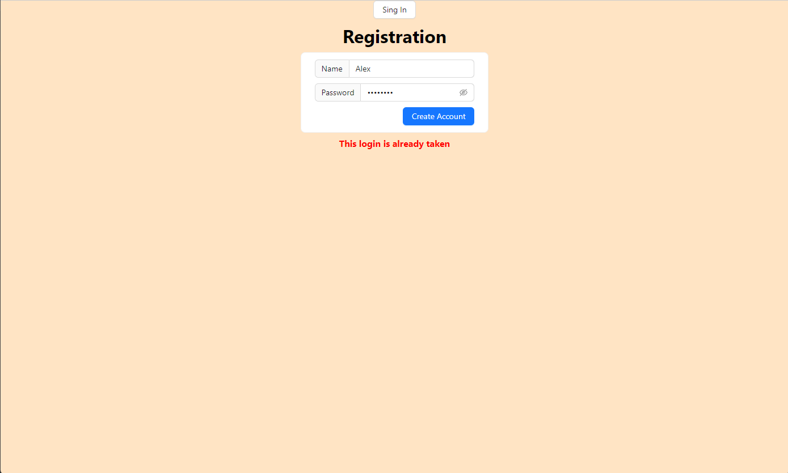

## Авторизация
На экране авторизации пользователь вводит свой логин и пароль. Если аккаунта не существует или пароль неверный, то пользователь получает соответствующее сообщение об ошибке.
При успешной авторизации пользователь переадресовывается на страницу списка комнат.

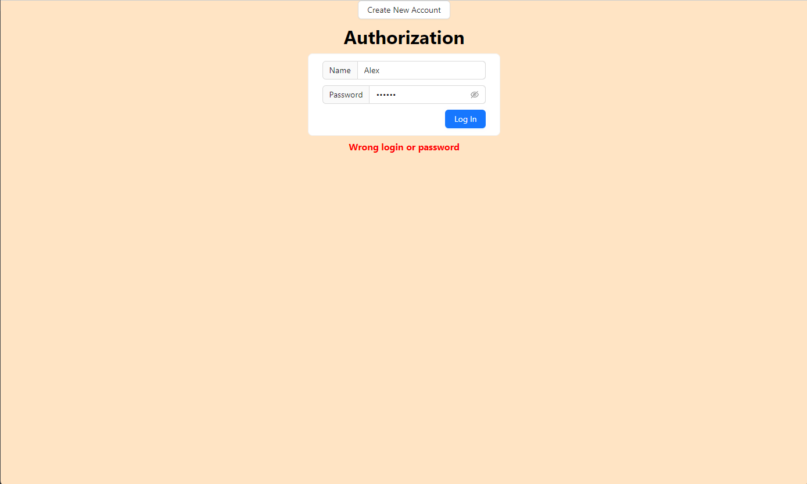

## Список комнат
На странице списка комнат отображается список всех активных комнат.
В каждую из комнат можно зайти.
Так же пользователь может создать свою комнату, нажав кнопку "Create room". Откроется всплывающее окно создания комнаты.

Так же в комнату пользователь может попасть по прямой ссылке. 
Таким образом можно пригласить друга сразу в комнату.

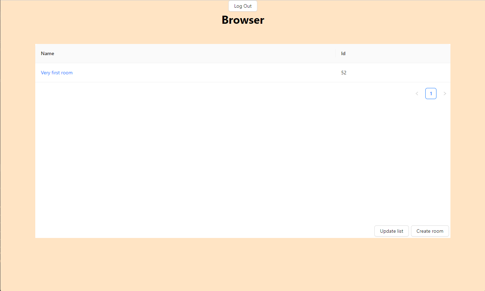

## Создание комнаты
На экране создания комнат пользователь может ввести название комнаты, которую он хочет создать.
Если такая комната уже существует, ему отображается сообщение об этом.
При успешном создании комнаты пользователь переедресовывается на страницу комнаты.

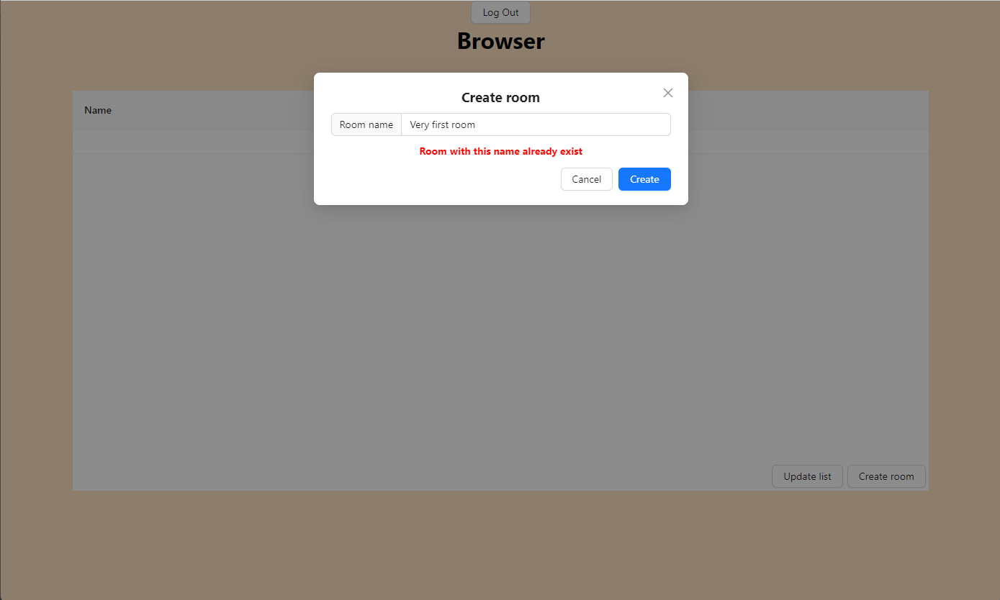

## Комната
Попадая в комнату пользователь становится рисующим или угадывающим.
В каждом комнате всего один рисующий. Если рисующий выходит из игры, случайным образом выбирается новый рисующий.
Если из комнаты вышли все пользователи, комната удаляется.

Рисующему дается на выбор три слова.

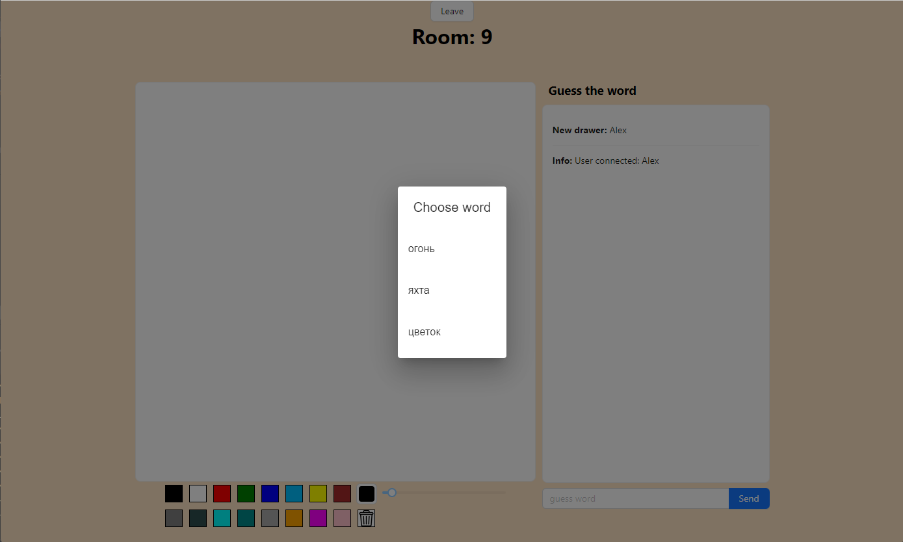

Послы выбора слова рисующий приступает его рисованию.
Он может:
- выбрать цвет из уже заготовленных или указать его на палитре
- выбрать размер кисти
- очистить холст
  Так же рисующий может видеть чат и лайкать или дизлайкать слова, таким образом подсказывая угадывающим.

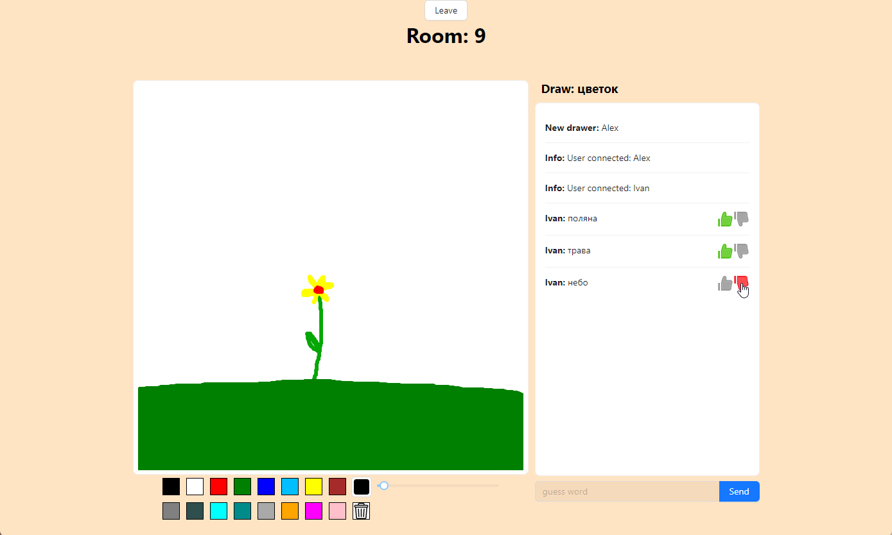

Угадывающий может писать слова в чат, а также видит всё что рисует рисующий и его реакции на слова в чате.

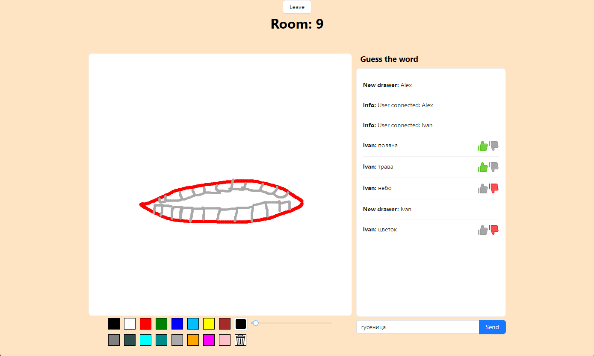

Когда угадывающий пишет правильное слово в чате он становится рисующим.

## Друзья
На этом экране можно увидеть список друзей и список всех входящих/исходящих запросов в друзья.

В списке друзей отображается в какой комнате сейчас играют друзья. Нажав на комнату, можно перейти на неё.

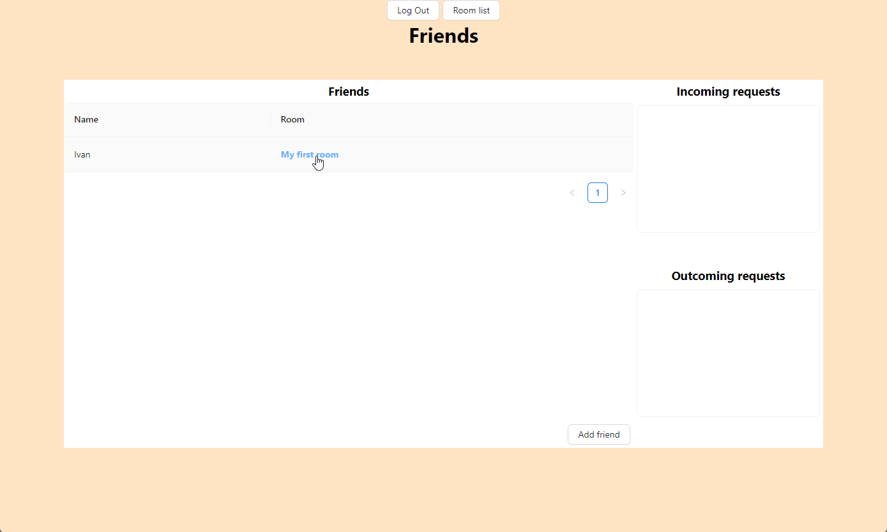

В списке входящих запросов отображается имя пользователя, а также кнопки, нажатие на которые принимает или отклоняет запрос.
В списке исходящих запросов отображается имя пользователя, а также кнопка, нажатие на которую отменяет запрос.

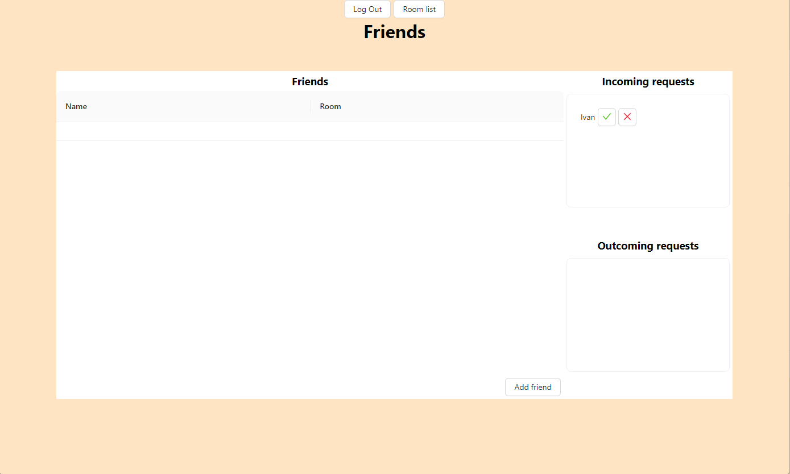

Нажатие на кнопку "Add friend" открывает всплывающее окно, 
в котором можно ввести текст и увидеть список пользователей, имя которых начинается с этого текста.
Рядом с именем пользователя отображаются значки "отправить запрос", "отменить запрос" и "уже в друзьях".
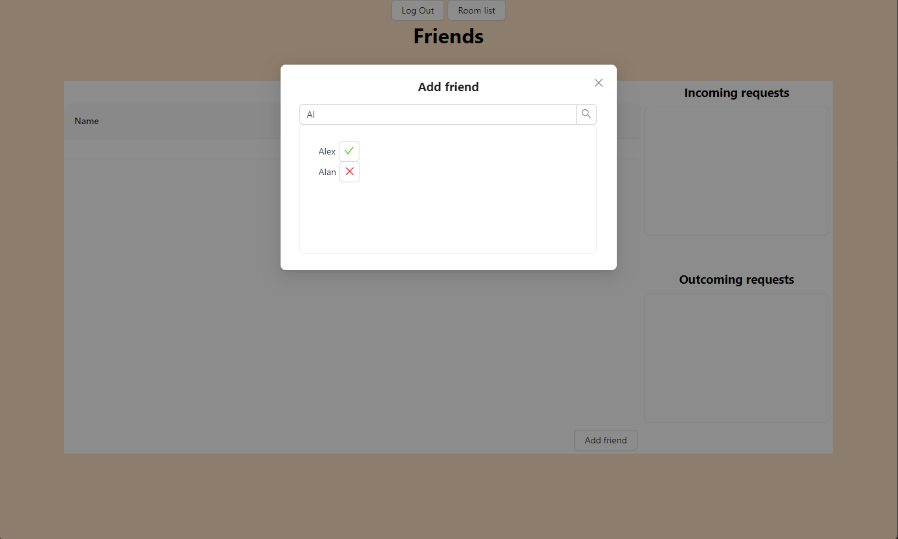

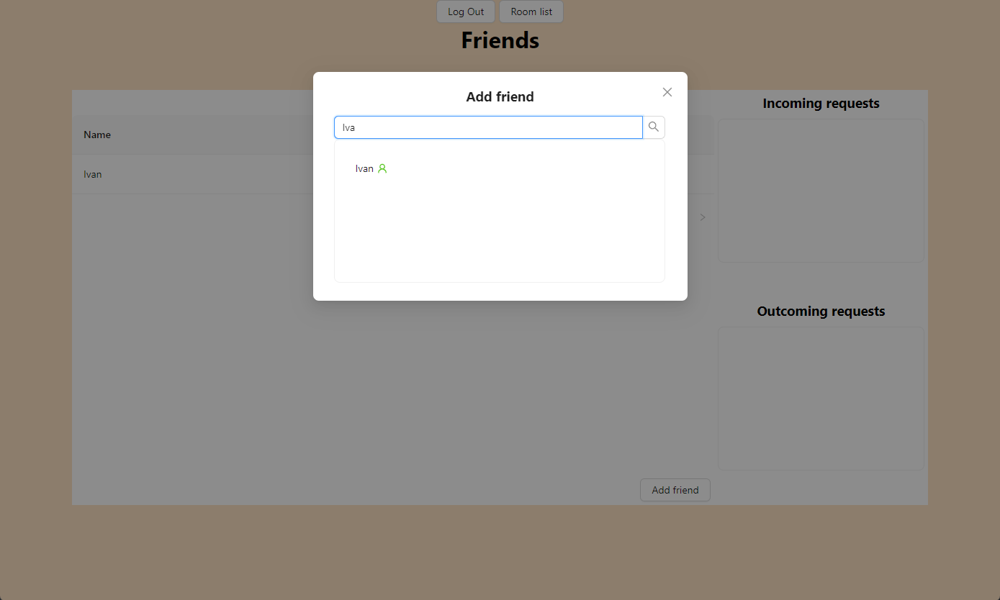
